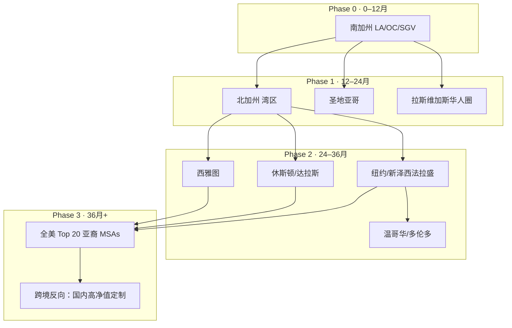
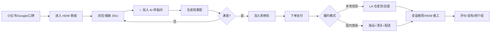
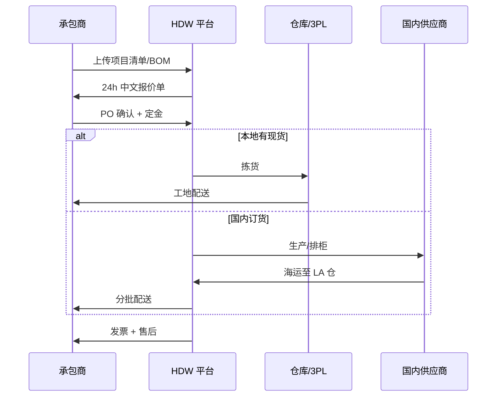
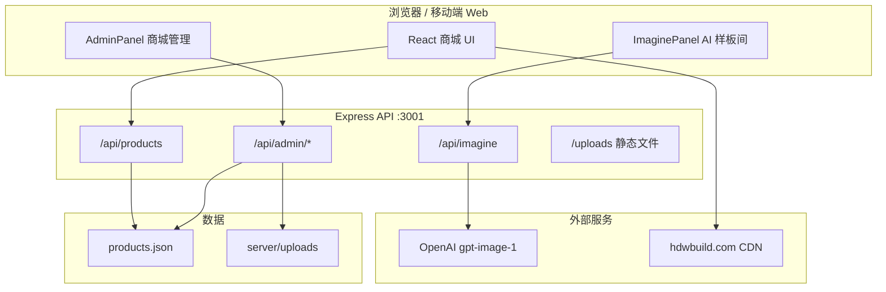
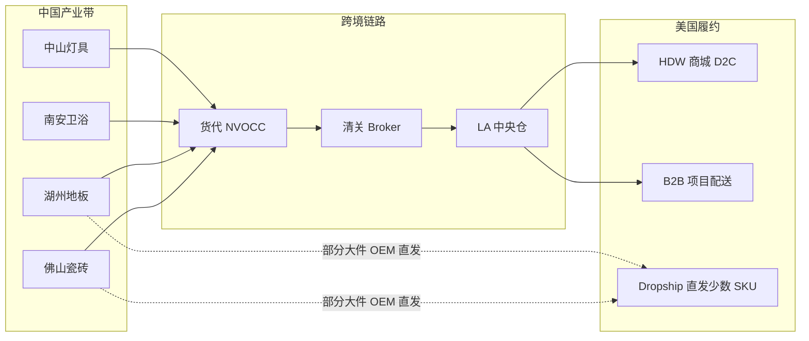
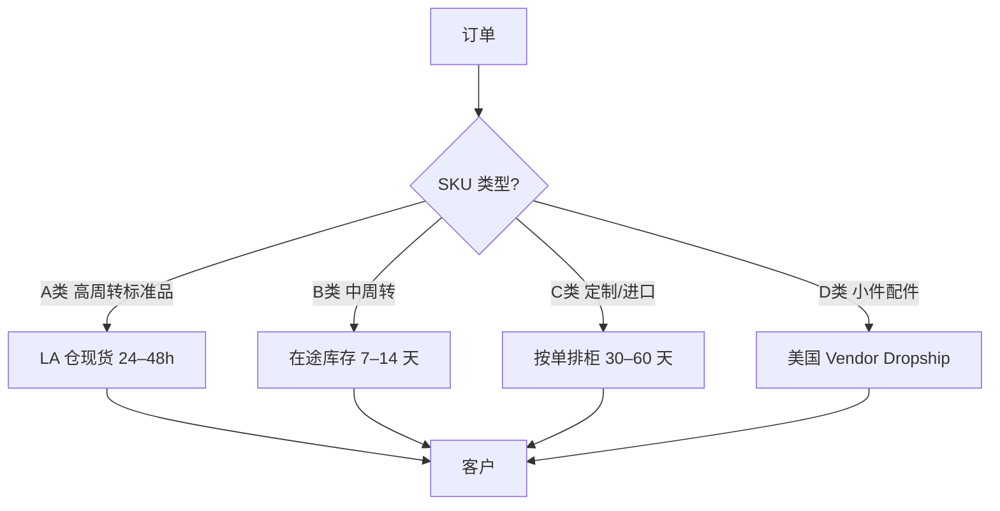
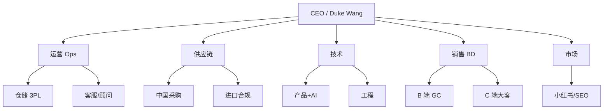
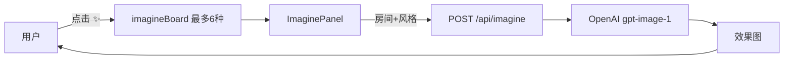

# HDW 建材城 · 商业策划书

**HDW LLC — 构筑理想空间，智造美好生活**

| 项目 | 内容 |
|------|------|
| 主体 | HDW LLC（加州注册建筑/建材服务实体） |
| 总部 | 5134 Biloxi Ave., North Hollywood, CA 91601 |
| 联系人 | Duke Wang · 323-853-3333 · dukewang@gmail.com |
| 产品形态 | 线上建材商城 + AI 智能样板间 + 后台商品管理 |
| 文档版本 | v1.0 · 2026年6月 |
| 初版市场 | 北美华人 · 南加州（Greater Los Angeles） |

---

## 目录

1. [执行摘要](#1-执行摘要)
2. [现有产品能力与资产盘点](#2-现有产品能力与资产盘点)
3. [核心竞争优势](#3-核心竞争优势)
4. [市场定位：北美华人与南加州 Niche](#4-市场定位北美华人与南加州-niche)
5. [客户分层：C 端与 B 端](#5-客户分层c-端与-b-端)
6. [南加州目标 B 端客户清单（示例）](#6-南加州目标-b-端客户清单示例)
7. [业务流程与系统架构简图](#7-业务流程与系统架构简图)
8. [分阶段扩张路线图](#8-分阶段扩张路线图)
9. [国内建材 Supplier 与进口计划](#9-国内建材-supplier-与进口计划)
10. [不囤货 Dropshipping 可行性分析](#10-不囤货-dropshipping-可行性分析)
11. [融资计划](#11-融资计划)
12. [融资用途明细](#12-融资用途明细)
13. [团队与组织规划](#13-团队与组织规划)
14. [财务预测框架（3 年）](#14-财务预测框架3-年)
15. [风险与对策](#15-风险与对策)
16. [附录：品牌与产品视觉](#16-附录品牌与产品视觉)

---

## 1. 执行摘要

HDW 建材城是在 HDW LLC 数十年南加州建筑实践基础上，将 **工程选材能力** 与 **数字化交易** 结合的垂直建材平台。现有 MVP 已具备：

- 全品类建材在线展示与购物车
- **AI 智能样板间**（OpenAI 图像生成，以真实建材图为参考）
- **管理员后台**（上传图片、改价、增删 SKU）
- 与 [hdwbuild.com](https://www.hdwbuild.com/) 品牌资产打通

**商业命题：** 南加州华人业主与中小承包商面临「语言障碍 + 品类分散 + 选材不可视 + 进口渠道不透明」四重痛点。HDW 以 **中文服务 + 工程级选品 + AI 预览 + 中美供应链** 建立差异化，先从 LA 华人圈切入，再沿 I-5 / I-10 走廊向 OC、IE、湾区及北美其他华人聚居区复制。

**融资目标（建议）：** Seed 轮 **$800K – $1.5M**，用于线下体验点、履约网络、供应链签约、技术团队与合规进口体系；18–24 个月内实现南加州 GMV 可验证模型，为 A 轮区域扩张做准备。

---

## 2. 现有产品能力与资产盘点

### 2.1 已上线/已开发功能

| 模块 | 能力 | 商业价值 |
|------|------|----------|
| **建材商城** | 地板、瓷砖、墙漆、橱柜、卫浴、门窗、灯具、五金等 8 大类；搜索、分类、购物车 | 交易入口，SKU 可扩展至 500+ |
| **AI 智能样板间** | 用户选最多 6 种建材 → 选房间/风格 → GPT 图像模型生成效果图 | 降低 C 端决策成本，提升转化与客单价 |
| **商城管理后台** | 授权管理员登录；上传图片；新增/编辑/删除商品及价格 | 运营无需改代码即可上新 |
| **品牌官网资产** | Logo、Hero、工程案例图、服务图标（hdwbuild.com CDN） | 信任背书，零拍摄成本复用 |
| **API 后端** | Express；商品 JSON 持久化；图片上传至 `server/uploads` | 可对接 ERP、支付、物流 |

### 2.2 技术栈（可扩展性）

- 前端：React 18 + Vite 6（轻量、易部署）
- 后端：Node.js + Express
- AI：OpenAI `gpt-image-1`（images.edit / generate）
- 部署：可上 Vercel/Cloudflare + 独立 API 服务器，或单体 `npm run build`

### 2.3 尚未建设、但策划内规划的能力

| 优先级 | 能力 | 说明 |
|--------|------|------|
| P0 | 在线支付（Stripe）+ 订单系统 | 闭环交易 |
| P0 | B 端报价单 / 项目清单 | 服务承包商批量采购 |
| P1 | 物流追踪 + 仓配 WMS | 支持自营仓或 3PL |
| P1 | 供应商 Portal | 国内厂直连接单 |
| P2 | AR/3D 深化（基于现有 Frame3D 思路） | 沉浸式选材 |
| P2 | 多语言（简中/繁中/英/西语） | 扩张非华人市场 |

### 2.4 现有产品界面（品牌视觉）

**首页 Hero — 工程案例级视觉**

**品牌 Logo**

**工程案例素材（官网同源）**

**服务优势模块（设计 / 报价 / 项目管理 / 品控 / 客服）**

| 专业设计方案 | 透明报价流程 |
|:---:|:---:|
|  |  |

| 高效项目管理 | 严格品质控制 |
|:---:|:---:|
|  |  |

**商城建材实拍（示例 SKU，来自 hdwbuild.com uploads）**

---

## 3. 核心竞争优势

### 3.1 与 Home Depot / Floor & Decor / 1688 代购的差异

| 维度 | 大卖场 | 代购/海运群 | **HDW 建材城** |
|------|--------|-------------|----------------|
| 中文顾问 | 少 | 有但不专业 | **工程背景 + 中文母语** |
| 选材可视化 | 货架实物 | 无 | **AI 样板间 + 案例图** |
| 品类 | 全但杂 | 有限 | **工程验证过的精选 SKU** |
| B 端报价 | 零售为主 | 非标 | **项目清单 / 批量价（规划）** |
| 进口合规 | N/A | 风险高 | **正式进口 + 认证（规划）** |
| 本地履约 | 当日/次日 | 6–10 周 | **混合：本地现货 + 直发** |

### 3.2 护城河构建路径

1. **数据护城河**：AI 样板间用户偏好 → 热销 SKU 预测 → 备货/采购优化  
2. **供应链护城河**：与国内厂 signed 独家 LA 分销 / 贴牌  
3. **信任护城河**：HDW LLC 已完工项目背书 + 华人社区口碑（微信/小红书）  
4. **服务护城河**：「选材 → 设计建议 → 配送 → 安装推荐」一站式  

---

## 4. 市场定位：北美华人与南加州 Niche

### 4.1 为什么先做南加州华人

| 因素 | 数据/逻辑 |
|------|-----------|
| **人口** | 加州亚裔约 700 万+；LA County 亚裔占 county 人口约 15%+；San Gabriel Valley 为全美最密集华人聚居区之一 |
| **住房与翻新** | 南加州房龄高、ADU 政策推动加建；华人业主自住翻新 + 投资出租需求强 |
| **建材消费特征** | 偏好瓷砖、石塑地板、定制橱柜、智能卫浴；愿为「好看+耐用」付溢价 |
| **语言与服务** | 英文建材术语门槛高；需要中文规格解读、算量、辅材搭配 |
| **HDW 地缘** | 公司已在 North Hollywood，距 SG Valley、DTLA、Valley 工程市场均在 1 小时车程内 |

### 4.2 南加州核心华人聚居区（Phase 0 地推圈）

| 区域 | 代表城市 | 策略 |
|------|----------|------|
| **San Gabriel Valley** | Monterey Park, Alhambra, San Gabriel, Arcadia, Rowland Heights | 线下 popup、华人建材展、微信群 |
| **Orange County** | Irvine, Tustin, Lake Forest | 新建社区、HOA 翻新 |
| **San Fernando Valley** | North Hollywood, Studio City | 总部辐射、展厅 |
| **Inland Empire** | Chino, Ontario, Eastvale | 新建独栋、价格敏感批量 |

### 4.3 北美华人市场扩展顺序（Population 导向）

**扩张复制公式（每进入一城）：**

1. 选 1 个 **卫星 showroom / 合作仓**（3PL 或建材店联营）  
2. 招募 1 名 **本地中文建材顾问**（懂算量 + 基本施工）  
3. 复制 SEO/小红书/Google Maps + 本地 WeChat 群  
4. 签约 2–3 家本地 **安装 Subcontractor** 作为推荐网络  
5. 90 天 GMV 验证后加大 SKU 与现货深度  

---

## 5. 客户分层：C 端与 B 端

### 5.1 C 端（零售/翻新业主）— 最高需求品类

| 客户画像 | 典型项目 | 高需求建材 | 客单价区间 |
|----------|----------|------------|------------|
| **自住翻新华人** | 厨房/浴室改造 | 橱柜、石英石台面、瓷砖、卫浴套装 | $8K–$40K |
| **ADU 业主** | 后院附属单元 | 地板 SPC、门窗、洁具、灯具 | $5K–$25K |
| **投资房东** | 出租单元快翻 | 耐磨地板、乳胶漆、五金 | $3K–$15K |
| **新移民首购** | 全屋软装建材 | 地板+瓷砖+灯具套餐 | $10K–$50K |
| **DIY 爱好者** | 局部替换 | 地板、墙漆、五金 | $500–$5K |

**C 端获客渠道：** 小红书 LA 装修、WeChat 业主群、Google「洛杉矶 地板 中文」、HDW 官网 SEO、AI 样板间社交分享、华人电台/自媒体 KOL。

### 5.2 B 端（承包商/设计师/物业）— 最高需求品类

| 客户类型 | 采购特征 | 高需求建材 | 合作模式 |
|----------|----------|------------|----------|
| **General Contractor（总包）** | 批量、账期、稳定规格 | 地板、瓷砖、门窗、橱柜 | 项目价目表 + 账期 30 天 |
| **ADU 专业承包商** | 标准化套餐、交期紧 | SPC 地板、预制卫浴、外墙板 | 套餐 BOM 一键下单 |
| **室内设计师 / Stylist** | 小样 + 效果图 | 特色瓷砖、灯具、五金 | 返点 5–10% |
| **Property Management** | 维修替换、价格敏感 | 工程地板、乳胶漆、门锁 | 年度框架协议 |
| **橱柜/石材加工坊** | 原料批发 | 板材、石英石、五金铰链 | 批发价 + 自提 |
| **商业 Tenant Improvement** | 合规 + 防火等级 | 商业地板、隔断、灯具 | 投标配合 |

**B 端核心诉求：** 稳定供货、中文规格书、发票（1099/W-9）、退换货政策、工地配送时段、技术数据（ASTM、CARB TSCA VI）。

---

## 6. 南加州目标 B 端客户清单（示例）

> 以下为 **公开市场信息下的目标类型与代表企业方向**，便于 BD  outreach；并非已签约客户。

### 6.1 总包与翻新类（General Contractor / Remodeling）

| 类型 | 代表方向 / 公开主体 | 区域 | 合作切入点 |
|------|---------------------|------|------------|
| 住宅翻新总包 | 各类 SG Valley 华人 GC（Google Maps「Los Angeles Chinese contractor」前列） | SGV | 地板+瓷砖集采价 |
| 设计施工一体 | 服务 Irvine / Tustin 新建社区的 Asian-owned remodel firms | OC | 橱柜卫浴套餐 |
| ADU 专业 | 专注 CA ADU 法案的 specialty builders（LA/OC 多家） | LA/OC | ADU 标准 BOM |
| 商业 TI | Downtown LA / Koreatown 商业翻新承包商 | LA | 工程地板批量 |

### 6.2 建材相关 trades（可互为渠道）

| 类型 | 说明 | HDW 价值 |
|------|------|----------|
| **Flooring installers** | 独立安装队，无展厅 | 供货 + 返佣 |
| **Tile setters** | 瓷砖工 | 进口砖独家价 |
| **Cabinet shops** | 小型橱柜加工 | 板材与五金 |
| **Stone fabricators** | 石英石台面厂 | 大板 import 协同 |

### 6.3 设计机构

| 类型 | 区域 | 合作模式 |
|------|------|----------|
| 华人室内设计师工作室 | Beverly Hills / Arcadia / Irvine | AI 样板间 co-brand |
| 建筑事务所（Residential） | Pasadena / Silver Lake | 规格书配合 |

### 6.4 物业与 multifamily

| 类型 | 说明 |
|------|------|
| 华人房东小型 PM 公司 | 10–50 单元，重复采购工程地板 |
| Student housing / Airbnb 运营者 | 快翻新套餐 |

**BD 优先级公式：** `华人背景 × 年项目量 × 建材自营比例 × 地理距离(≤30mi)` 评分排序，Top 50 账户做 Q1 拜访。

---

## 7. 业务流程与系统架构简图

### 7.1 C 端用户旅程

### 7.2 B 端项目采购流程

### 7.3 现有技术架构

### 7.4 目标供应链架构（融资后）

---

## 8. 分阶段扩张路线图

### Phase 0（0–6 月）：南加州 MVP 验证

| 目标 | KPI |
|------|-----|
| 上线支付与订单 | 首 100 单 |
| LA 卫星 showroom（500–1500 sqft） | 月访客 200+ |
| 签约 3 家国内厂 | 20 个独家 SKU |
| B 端 10 家 GC 试点 | B 端 GMV 占 30% |
| 小红书/WeChat 内容 50 篇 | CAC < $80 |

### Phase 1（6–18 月）：南加州深度 + 北加试点

| 目标 | KPI |
|------|-----|
| LA 中央仓 5,000–10,000 sqft | 本地现货 SKU 200+ |
| OC / SGV _popup 2 场/季 | 品牌认知 |
| 湾区联盟仓（3PL） | 北加首 50 单 |
| 技术：B 端报价系统 | 报价自动化 80% |
| 团队 8–12 人 | — |

### Phase 2（18–36 月）：西线扩张

- 圣地亚哥、拉斯维加斯、西雅图  
- 引入西班牙语界面（服务 OC 拉丁裔 crossover）  
- 自有轻卡车队或签约 Last-mile 专配  

### Phase 3（36 月+）：全国华人 MSAs + 品类品牌

- 纽约、休斯顿、达拉斯、芝加哥  
- 自有贴牌 line（HDW Collection 地板/瓷砖）  
- 考虑垂直 SaaS：华人 GC 的选材工具 white-label  

---

## 9. 国内建材 Supplier 与进口计划

### 9.1 建议对接产业带与品类

| 产业带 | 品类 | 代表 Supplier 类型 | 进口方式 |
|--------|------|-------------------|----------|
| **广东佛山/南庄** | 瓷砖、岩板 | 工厂 OEM/OBM | 20'GP / 40'HQ 整柜 |
| **浙江湖州/南浔** | 实木复合、SPC 地板 | 品牌厂/白牌厂 | 整柜 + 部分 LCL |
| **福建南安** | 卫浴五金、龙头 | OEM 厂 | 整柜混装 |
| **广东中山/古镇** | 灯具 | ODM | 与卫浴混柜 |
| **江苏常州** | 工程地板 | 工程专供厂 | B 端项目柜 |
| **上海/苏州** | 橱柜板件、五金 | 定制配套 | 项目制 |

> **Supplier 开发原则：** 有 FDA/CARB/TSCA VI 意识、有美国出口经验、MOQ 可谈、可小单拼柜。

### 9.2 进口合规要点（美国）

| 项目 | 说明 |
|------|------|
| **HS Code** | 因品类而异（如瓷砖 6907、地板 4418/3918） |
| **关税** | Section 301 对华加征因 HS 不同；需 broker 精算 |
| **认证** | CARB TSCA Title VI（复合木）；Lead-free plumbing（AB 1953）；部分 UL 电气 |
| **标签** | 英文标签、原产地、制造商信息 |
| **Bond / ISF** | 连续进口需 Customs Bond |
| **时效** | 海运 14–18 天到 LA/LB 港 + 清关 3–7 天 + 拖柜入仓 |

### 9.3 三阶段进口策略

| 阶段 | 策略 | 库存 |
|------|------|------|
| **验证期** | 2–3 个 40HQ 测试柜，Top 20 SKU | 轻库存，高周转 |
| **成长期** | 季度合同 + 安全库存 45 天 | LA 中央仓 |
| **成熟期** | 独家代理 + 贴牌 | 多仓（LA + Bay Area） |

### 9.4 参考 Supplier 开发渠道（非独家清单）

| 渠道 | 用途 |
|------|------|
| 阿里巴巴国际站 / Made-in-China | 初筛厂 |
| 广交会 / 上海建博会 / 佛山陶博会 | 深度验厂 |
| 现有 HDW 工程材料现有供应商 | 最快转化 |
| 美国华人进口商反向介绍 | 减少踩坑 |

---

## 10. 不囤货 Dropshipping 可行性分析

### 10.1 结论摘要

| 模式 | 可行性 | 适用 SKU | 不适用 |
|------|--------|----------|--------|
| **国内厂直发美国 C 端** | ⚠️ 低 | 小件五金、灯具配件 | 地板瓷砖（太重太贵） |
| **国内厂直发美国 B 端项目** | ⚠️ 中 | 定制橱柜（项目制） | 紧急工地需求 |
| **美国本土供应商 Dropship** | ✅ 高 | 涂料、五金、部分灯具 | 价格无优势时 |
| **HDW 集柜后单件拆发** | ✅ 中高 | 已入库 SKU 的尾货 | 需最小库存 |
| **Vendor 仓内代发（3PL）** | ✅ 高 | 标准品 | 需 IT 对接 |

### 10.2 建材 Dropship 特殊限制

1. **重量与运费：** 地板/瓷砖按 sqft 计，单客户 500 sqft 即超重，直发运费可能 > 商品毛利  
2. **Lead Time：** 纯 dropship 海运 6–10 周，无法与 Home Depot 次日达竞争  
3. **退换货：** 建材破损率高，无仓即无法做 QC 与换货  
4. **样品：** C 端决策依赖小样，dropship 难以提供  
5. **B 端账期：** GC 要 NET30，dropship 现金流更紧张  

### 10.3 推荐混合模型（Hybrid）

**建议 SKU 分类：**

- **A 类（必囤货）：** Top 20 地板/瓷砖（占 GMV 60%）  
- **B 类（在途）：** 已下 PO 未到港  
- **C 类（按单）：** 大规格岩板、定制橱柜  
- **D 类（dropship）：** 五金、灯具、辅材  

**纯不囤货仅适合：** 内容电商阶段验证需求；正式规模化必须 **「轻库存 + 在途 + 国内直采」混合**。

---

## 11. 融资计划

### 11.1 融资轮次建议

| 轮次 | 时间 | 金额 | 估值（Pre） | 用途 |
|------|------|------|-------------|------|
| **Seed** | 2026 Q3 | **$800K – $1.5M** | $4M – $6M | 南加州模型验证 |
| **Pre-A** | 2027 Q4 | $3M – $5M | $12M – $18M | 西线 3 城 + 仓配 |
| **Series A** | 2029 | $8M – $15M | $35M+ | 全国华人 MSAs |

### 11.2 Seed 轮资金结构（建议 $1.2M 基准）

| 来源 | 比例 | 金额 |
|------|------|------|
| 创始团队 / HDW LLC | 15% | $180K |
| 天使（建材/地产/华人商圈） | 35% | $420K |
| 机构 Seed（消费/供应链/华人基金） | 50% | $600K |

### 11.3 投资人匹配方向

- 加州亚裔企业家网络（APAPA、各类商会）  
- PropTech / 家居零售 Seed 基金  
- 跨境供应链背景天使  
- 战略投资：区域 3PL、美国地板分销商（小股权合作）  

### 11.4 里程碑对赌（18 个月）

| 里程碑 | 目标 |
|--------|------|
| GMV | $2.5M+ 累计 |
| 毛利率 |  blended 28–35% |
| 复购率 | C 端 25%+ |
| B 端账户 | 活跃 80+ |
| SKU | 500+（现货+可订） |
| 团队 | 12 人 |

---

## 12. 融资用途明细

### 12.1 $1.2M Seed 分配

| 类别 | 占比 | 金额 | 明细 |
|------|------|------|------|
| **线下拓展** | 22% | $264K | SGV/OC showroom 装修押金+首年租金；Popup；样品墙 |
| **仓储物流** | 25% | $300K | LA 3PL 或小型仓租；首 4 个 40HQ 头程+关税；托盘/叉车 |
| **供应链** | 18% | $216K | 验厂差旅；独家协议保证金；合规认证检测 |
| **技术产品** | 20% | $240K | 2 工程师 12 月；支付/订单/WMS；AI 样板间优化 |
| **市场获客** | 10% | $120K | 小红书/Google Ads/KOL；建材展展位 |
| **团队人力** | 5% | $60K | 建材顾问×2、运营×1 部分年薪 |
| **法务合规** | 5% | $60K | 进口合规、合同、保险、公司架构 |
| **储备金** | 5% | $60K | 现金流缓冲 |

### 12.2 线下拓展具体计划（$264K）

| 项目 | 说明 |
|------|------|
| **North Hollywood 展厅升级** | 利用现有地址，800 sqft 选材中心 + AI 大屏 |
| **SGV Popup（Monterey Park / Rowland Heights）** | 6 个月 rotating popup，共享建材店联营 |
| **样品借出系统** | 地板/瓷砖 cut sample 借给设计师与 GC |

### 12.3 仓储计划（$300K）

| 阶段 | 方案 |
|------|------|
| 0–6 月 | 签约 LA County 3PL（Commerce / Vernon 产业带），500 pallet 位 |
| 6–12 月 | 评估自营 5,000 sqft 前置仓（Vernon / City of Industry） |
| 不囤货原则 | 仅 A 类 SKU 备货；B/C 类在途或按单 |

### 12.4 技术投入（$240K）

| 岗位 | 职责 |
|------|------|
| **全栈工程师** | 订单、支付、B 端报价、Admin 增强 |
| **前端/AI 工程师** | 样板间体验、移动端 PWA、性能 |
| **外包 DevOps** | 部署、监控、CI/CD |

优先级功能：**Stripe 结账 → 订单状态 → B 端 Quote PDF → 库存同步 → 微信通知（Enterprise WeChat / 邮件）**

### 12.5 地区拓展预算（含于市场+线下）

| 季度 | 动作 | 预算 |
|------|------|------|
| Q1 | LA 本地 | $30K |
| Q2 | OC + IE | $25K |
| Q3 | 湾区试点仓 | $40K |
| Q4 | SD + LV 地推 | $25K |

---

## 13. 团队与组织规划

### 13.1 现有核心

| 角色 | 人员 | 优势 |
|------|------|------|
| 创始人 / 建筑业务 | Duke Wang | 本地工程网络、品牌、供应链直觉 |
| 技术（当前 MVP） | 已交付商城+AI+Admin | 可迭代 |

### 13.2 Seed 阶段编制（目标 12 人）

| 部门 | 岗位 | 人数 |
|------|------|------|
| 管理层 | CEO / 运营总监 | 1–2 |
| 销售 BD | B 端客户经理 | 2 |
| 顾问 | 中文建材顾问（C 端） | 2 |
| 供应链 | 采购 / 进口专员 | 1 |
| 仓储 | 3PL 协调（可外包） | 0.5 |
| 市场 | 内容+社群 | 1 |
| 技术 | 全栈 + 前端 | 2 |
| 财务行政 | 兼职 CFO / Bookkeeper | 0.5 |

### 13.3 组织演进

---

## 14. 财务预测框架（3 年）

> 以下为 **模型假设**，非承诺业绩；单位：美元。

### 14.1 收入假设

| 年份 | GMV | 净收入（Take rate） | 净收入率 |
|------|-----|---------------------|----------|
| Y1 | $1.8M | $540K | 30% 毛利近似 |
| Y2 | $5.5M | $1.65M | 30% |
| Y3 | $12M | $3.6M | 30% |

Take rate 含：零售差价 + B 端批量 margin + 设计咨询费 + 未来物流服务费。

### 14.2 成本结构（Y1）

| 项目 | 占 GMV |
|------|--------|
| COGS（含进口、关税、运费） | 62% |
| 履约仓储 | 8% |
| 营销 | 12% |
| 人力 | 15% |
| G&A | 5% |

### 14.3 盈亏平衡点

- 固定成本约 **$35K/月**（Seed 精简团队）  
- 贡献毛利率 **28%** 时，月 GMV **~$125K** 可打平  
- 预计 **Month 14–18** 达到（依赖 B 端占比提升）  

---

## 15. 风险与对策

| 风险 | 等级 | 对策 |
|------|------|------|
| 301 关税上升 | 高 | 多 HS 结构；越南/墨西哥 secondary sourcing |
| 海运波动 | 中 | 季度 PO；安全库存仅 A 类 |
| 大厂价格竞争 | 中 | 差异化服务+华人 niche，不拼绝对低价 |
| AI 成本 | 低 | 样板间限次/注册后可用；缓存模板 |
| 建材破损退换 | 中 | 入仓 QC；明确退换政策 |
| 现金流（B 端账期） | 高 | 定金 30%；NET30 仅成熟 GC |
| 合规 | 高 | 专职 broker + CARB 批次证书 |

---

## 16. 附录：品牌与产品视觉

### 16.1 一句话定位

**「南加州华人的工程级建材商城 — 看得见效果，算得清价格，送得到工地。」**

### 16.2 AI 样板间工作流（现有实现）

### 16.3 联系方式

- **HDW LLC**  
- 5134 Biloxi Ave., North Hollywood, CA 91601  
- Duke Wang · 323-853-3333 · dukewang@gmail.com  
- 官网：[hdwbuild.com](https://www.hdwbuild.com/)  
- 商城 Demo：本地 `npm run dev` → http://localhost:5173  

---

*本文档基于 HDW 建材城现有代码与 HDW LLC 公开品牌信息整理，供内部融资与战略规划使用。市场数据、客户名单及财务预测需在正式融资前由法务、财务及行业顾问进一步核实。*
